# CatatCuan - Use Case Diagram & Specification

**Version:** 1.0  
**Date:** 2026-01-21  
**Phase:** Design

---

## 1. Actors

| Actor | Deskripsi |
|-------|-----------|
| **Pemilik Warung** | Pengguna utama aplikasi mobile, mencatat transaksi harian |
| **Admin** | Pengelola sistem via web dashboard |
| **System** | Proses otomatis (sync, notifikasi, kalkulasi) |

---

## 2. Use Case Diagram

### Visual Diagram (Figma)


### Mermaid Diagram

```mermaid
flowchart TB
    subgraph Actors
        PW((Pemilik Warung))
        Admin((Admin))
        Sys((System))
    end

    subgraph "Authentication"
        UC01[UC-01: Register]
        UC02[UC-02: Login]
        UC03[UC-03: Logout]
        UC04[UC-04: Reset Password]
    end

    subgraph "Onboarding & Setup"
        UC05[UC-05: View Onboarding]
        UC06[UC-06: Setup Profil Warung]
        UC07[UC-07: Setup Saldo Awal]
    end

    subgraph "Transaksi Penjualan (POS)"
        UC10[UC-10: Catat Penjualan]
        UC10a[UC-10a: Scan Barcode]
        UC10b[UC-10b: Input Uang Cepat]
        UC10c[UC-10c: Lihat Struk Digital]
        UC11[UC-11: Lihat Riwayat Penjualan]
        UC12[UC-12: Edit Penjualan]
        UC13[UC-13: Hapus Penjualan]
    end

    subgraph "Manajemen Produk"
        UC20[UC-20: Tambah Produk]
        UC20a[UC-20a: Input Harga Modal & Jual]
        UC21[UC-21: Lihat Daftar Produk]
        UC24[UC-24: Cari Produk]
        UC25[UC-25: Lihat Analisis Margin]
        UC26[UC-26: Terima Alert Stok Rendah]
    end

    subgraph "Pengeluaran (Expense)"
        UC30[UC-30: Catat Pengeluaran]
        UC30a[UC-30a: Upload Bukti Struk]
        UC31[UC-31: Lihat Riwayat Pengeluaran]
        UC34[UC-34: Kategorisasi Pengeluaran]
    end

    subgraph "Buku Kas"
        UC40[UC-40: Lihat Saldo Kas Real-time]
        UC41[UC-41: Lihat Mutasi Kas]
        UC43[UC-43: Hitung Profit Harian]
    end

    subgraph "Manajemen Hutang"
        UC50[UC-50: Catat Hutang]
        UC50a[UC-50a: Set Jatuh Tempo]
        UC51[UC-51: Lihat Daftar Hutang]
        UC52[UC-52: Bayar Cicilan Hutang]
    end

    subgraph "Pelanggan"
        UC60[UC-60: Tambah Pelanggan]
        UC61[UC-61: Lihat Daftar Pelanggan]
        UC64[UC-64: Lihat Riwayat Belanja]
    end

    subgraph "Laporan"
        UC70[UC-70: Lihat Laporan Laba/Rugi]
        UC71[UC-71: Lihat Produk Terlaris]
        UC73[UC-73: Export Laporan Excel/PDF]
    end

    subgraph "Admin: Dashboard Statistik"
        UC80[UC-80: Lihat Total User]
        UC81[UC-81: Lihat Volume Transaksi Global]
        UC82[UC-82: Lihat Grafik Pertumbuhan User]
    end

    subgraph "Admin: Manajemen Pengguna"
        UC83[UC-83: Lihat Daftar Warung]
        UC84[UC-84: Aktivasi/Suspend Akun]
        UC85[UC-85: Reset Password User]
    end

    subgraph "Admin: Maintenance System"
        UC86[UC-86: Toggle Maintenance Mode]
        UC87[UC-87: Force Update Version]
        UC88[UC-88: Backup Database]
        UC89[UC-89: Cleanup Data Sampah]
    end

    subgraph "Admin: Master Data"
        UC90a[UC-90: Kelola Kategori Produk Default]
    end

    subgraph "System Functions"
        UC90[UC-90: Sync Data]
        UC91[UC-91: Auto Calculate Change]
    end

    %% Connections
    PW --> UC10
    UC10 -.-> UC10a
    UC10 -.-> UC10b
    UC10 -.-> UC10c
    PW --> UC11 & UC12 & UC13
    
    PW --> UC20 & UC21 & UC24 & UC25 & UC26
    UC20 -.-> UC20a

    PW --> UC30 & UC31 & UC34
    UC30 -.-> UC30a

    PW --> UC40 & UC41 & UC43

    PW --> UC50 & UC51 & UC52
    UC50 -.-> UC50a

    PW --> UC60 & UC61 & UC64

    PW --> UC70 & UC71 & UC73
    
    UC10 -.-> UC91
```



---

## 3. Use Case List by Feature

### 3.1 Authentication & Onboarding

| UC ID | Use Case | Priority | Complexity |
|-------|----------|----------|------------|
| UC-01 | Register dengan Nomor Telepon | 🔴 High | Low |
| UC-02 | Login | 🔴 High | Low |
| UC-03 | Logout | 🔴 High | Low |
| UC-04 | Reset Password | 🟡 Medium | Medium |
| UC-05 | View Onboarding Slides | 🟡 Medium | Low |
| UC-06 | Setup Profil Warung | 🔴 High | Low |
| UC-07 | Setup Saldo Awal (Modal) | 🔴 High | Low |

### 3.2 Transaksi Penjualan

| UC ID | Use Case | Priority | Complexity |
|-------|----------|----------|------------|
| UC-10 | Catat Penjualan (Quick Entry) | 🔴 High | Medium |
| UC-11 | Lihat Riwayat Penjualan | 🔴 High | Low |
| UC-12 | Edit Penjualan | 🟡 Medium | Low |
| UC-13 | Hapus Penjualan | 🟡 Medium | Low |

### 3.3 Produk

| UC ID | Use Case | Priority | Complexity |
|-------|----------|----------|------------|
| UC-20 | Tambah Produk Baru | 🔴 High | Low |
| UC-21 | Lihat Daftar Produk | 🔴 High | Low |
| UC-22 | Edit Produk | 🟡 Medium | Low |
| UC-23 | Hapus Produk | 🟡 Medium | Low |
| UC-24 | Cari Produk | 🟡 Medium | Low |

### 3.4 Pengeluaran

| UC ID | Use Case | Priority | Complexity |
|-------|----------|----------|------------|
| UC-30 | Catat Pengeluaran | 🔴 High | Low |
| UC-31 | Lihat Riwayat Pengeluaran | 🔴 High | Low |
| UC-32 | Edit Pengeluaran | 🟡 Medium | Low |
| UC-33 | Hapus Pengeluaran | 🟡 Medium | Low |
| UC-34 | Kategorisasi Pengeluaran | 🟢 Low | Low |

### 3.5 Buku Kas

| UC ID | Use Case | Priority | Complexity |
|-------|----------|----------|------------|
| UC-40 | Lihat Saldo Kas Saat Ini | 🔴 High | Low |
| UC-41 | Lihat Mutasi Kas | 🔴 High | Medium |
| UC-42 | Filter Transaksi by Date | 🟡 Medium | Low |
| UC-43 | Hitung Profit Harian | 🔴 High | Medium |

### 3.6 Hutang

| UC ID | Use Case | Priority | Complexity |
|-------|----------|----------|------------|
| UC-50 | Catat Hutang Pelanggan | 🔴 High | Medium |
| UC-51 | Lihat Daftar Hutang | 🔴 High | Low |
| UC-52 | Catat Pembayaran Hutang | 🔴 High | Medium |
| UC-53 | Hapus Hutang | 🟡 Medium | Low |

### 3.7 Pelanggan

| UC ID | Use Case | Priority | Complexity |
|-------|----------|----------|------------|
| UC-60 | Tambah Pelanggan | 🟡 Medium | Low |
| UC-61 | Lihat Daftar Pelanggan | 🟡 Medium | Low |
| UC-62 | Edit Pelanggan | 🟢 Low | Low |
| UC-63 | Hapus Pelanggan | 🟢 Low | Low |
| UC-64 | Lihat Riwayat Transaksi Pelanggan | 🟡 Medium | Medium |

### 3.8 Laporan

| UC ID | Use Case | Priority | Complexity |
|-------|----------|----------|------------|
| UC-70 | Lihat Laporan Harian | 🔴 High | Medium |
| UC-71 | Lihat Laporan Mingguan | 🟡 Medium | Medium |
| UC-72 | Lihat Laporan Bulanan | 🟡 Medium | Medium |
| UC-73 | Export Laporan ke Excel | 🔴 High | Medium |

### 3.9 Admin Dashboard (Web)

| UC ID | Use Case | Priority | Complexity |
|-------|----------|----------|------------|
| UC-80 | Lihat Daftar User | 🔴 High | Low |
| UC-81 | Aktivasi/Deaktivasi User | 🔴 High | Low |
| UC-82 | Set Maintenance Mode | 🟡 Medium | Low |

---

## 4. Use Case Specifications (Core Features)

### UC-10: Catat Penjualan

| Attribute | Description |
|-----------|-------------|
| **Actor** | Pemilik Warung |
| **Precondition** | User sudah login dan setup warung selesai |
| **Trigger** | User tap tombol "Penjualan" atau "+" |
| **Description** | Mencatat transaksi penjualan dengan cepat |

**Main Flow:**
1. User pilih produk dari list atau input manual
2. User input jumlah (quantity)
3. System hitung total otomatis
4. User pilih metode bayar (Tunai/Hutang)
5. IF Hutang → pilih/tambah pelanggan
6. User tap "Simpan"
7. System simpan ke database & update saldo kas
8. System tampilkan konfirmasi sukses

**Alternative Flow:**
- 4a. Jika produk belum ada → redirect ke Tambah Produk
- 5a. Pelanggan baru → buat pelanggan baru inline

**Postcondition:** 
- Transaksi tersimpan
- Saldo kas terupdate
- Stok produk berkurang (jika ada)

---

### UC-30: Catat Pengeluaran

| Attribute | Description |
|-----------|-------------|
| **Actor** | Pemilik Warung |
| **Precondition** | User sudah login |
| **Trigger** | User tap tombol "Pengeluaran" |

**Main Flow:**
1. User input nominal pengeluaran
2. User pilih kategori (Belanja Stok/Operasional/Pribadi)
3. User input keterangan (opsional)
4. User tap "Simpan"
5. System simpan & kurangi saldo kas
6. System tampilkan konfirmasi

**Business Rules:**
- Kategori "Pribadi" ditandai khusus untuk tracking "bocor alus"
- Pengeluaran > saldo kas → tampilkan warning

---

### UC-50: Catat Hutang Pelanggan

| Attribute | Description |
|-----------|-------------|
| **Actor** | Pemilik Warung |
| **Precondition** | User sudah login, pelanggan terdaftar |
| **Trigger** | Penjualan dengan metode bayar "Hutang" |

**Main Flow:**
1. System tampilkan form hutang
2. User pilih pelanggan (atau buat baru)
3. User konfirmasi jumlah hutang
4. User input tanggal jatuh tempo (opsional)
5. System simpan hutang
6. System update total hutang pelanggan

---

### UC-52: Catat Pembayaran Hutang

| Attribute | Description |
|-----------|-------------|
| **Actor** | Pemilik Warung |
| **Precondition** | Ada hutang yang belum lunas |

**Main Flow:**
1. User pilih pelanggan dengan hutang
2. System tampilkan daftar hutang
3. User input jumlah bayar
4. System hitung sisa hutang
5. IF lunas → tandai hutang selesai
6. System update saldo kas (uang masuk)

---

### UC-43: Hitung Profit Harian

| Attribute | Description |
|-----------|-------------|
| **Actor** | System (auto) / Pemilik Warung (view) |
| **Trigger** | Setiap ada transaksi baru / User buka Dashboard |

**Calculation:**
```
Profit Hari Ini = Total Penjualan Tunai 
                - Total Pengeluaran (non-pribadi)
                + Pembayaran Hutang Diterima
```

**Display:**
- Dashboard utama menampilkan angka profit prominently
- Warna hijau jika positif, merah jika negatif

---

## 5. Summary Statistics

| Category | Count |
|----------|-------|
| Total Use Cases | 35 |
| 🔴 High Priority | 18 |
| 🟡 Medium Priority | 13 |
| 🟢 Low Priority | 4 |
| Mobile Use Cases | 32 |
| Admin Use Cases | 3 |

---

*Generated: 2026-01-21*
