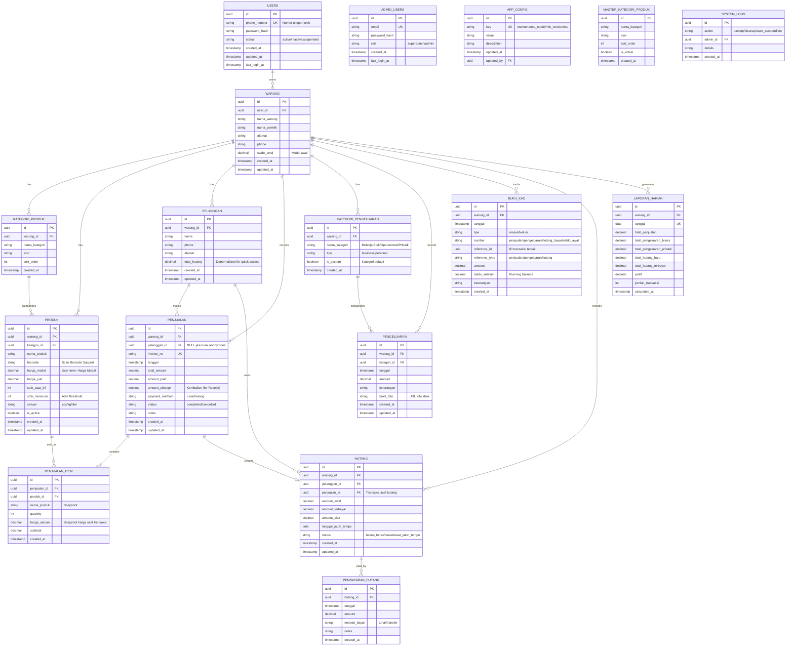

# CatatCuan - Entity Relationship Diagram (ERD)

**Version:** 1.0  
**Date:** 2026-01-21  
**Normalization:** 3NF Compliant

---

## 1. ERD Diagram

### Visual Diagram (Figma)


### Mermaid Diagram



---

## 2. Entity Details

### 2.1 Core Entities

| Entity | Description | Relationships |
|--------|-------------|---------------|
| `USERS` | Akun pengguna aplikasi | 1:N dengan WARUNG |
| `WARUNG` | Profil toko/warung | Parent dari semua entitas bisnis |

### 2.2 Product Management

| Entity | Description | Key Fields |
|--------|-------------|------------|
| `KATEGORI_PRODUK` | Kategori produk (Makanan, Minuman, dll) | nama_kategori, icon |
| `PRODUK` | Master data produk | harga_beli, harga_jual, stok |

### 2.3 Sales & Transactions

| Entity | Description | Key Fields |
|--------|-------------|------------|
| `PENJUALAN` | Header transaksi penjualan | invoice_no, payment_method |
| `PENJUALAN_ITEM` | Detail item per transaksi | quantity, harga_satuan (snapshot) |

### 2.4 Expenses

| Entity | Description | Key Fields |
|--------|-------------|------------|
| `KATEGORI_PENGELUARAN` | Jenis pengeluaran | tipe (business/personal) |
| `PENGELUARAN` | Record pengeluaran | amount, keterangan |

### 2.5 Cash Book

| Entity | Description | Purpose |
|--------|-------------|---------|
| `BUKU_KAS` | Jurnal kas masuk/keluar | Tracking saldo & mutasi |

### 2.6 Debt Management

| Entity | Description | Key Fields |
|--------|-------------|------------|
| `HUTANG` | Record hutang pelanggan | amount_sisa, status |
| `PEMBAYARAN_HUTANG` | Pembayaran cicilan | amount, metode_bayar |

---

## 3. Data Types & Constraints

### UUID Primary Keys
Semua tabel menggunakan `UUID` sebagai primary key untuk:
- Offline-first compatibility
- Conflict-free sync
- No sequential guessing

### Indexing Strategy

```sql
-- Foreign Keys (WAJIB di-index per rule #13)
CREATE INDEX idx_warung_user ON warung(user_id);
CREATE INDEX idx_produk_warung ON produk(warung_id);
CREATE INDEX idx_produk_kategori ON produk(kategori_id);
CREATE INDEX idx_penjualan_warung ON penjualan(warung_id);
CREATE INDEX idx_penjualan_pelanggan ON penjualan(pelanggan_id);
CREATE INDEX idx_penjualan_item_penjualan ON penjualan_item(penjualan_id);
CREATE INDEX idx_pengeluaran_warung ON pengeluaran(warung_id);
CREATE INDEX idx_hutang_pelanggan ON hutang(pelanggan_id);

-- Query Optimization
CREATE INDEX idx_penjualan_tanggal ON penjualan(warung_id, tanggal);
CREATE INDEX idx_buku_kas_tanggal ON buku_kas(warung_id, tanggal);
CREATE INDEX idx_hutang_status ON hutang(warung_id, status);
CREATE INDEX idx_produk_active ON produk(warung_id, is_active);
```

---

## 4. Normalization Verification (3NF)

### ✅ 1NF - Atomic Values
- Semua field berisi nilai atomik
- Tidak ada repeating groups
- Setiap tabel punya primary key

### ✅ 2NF - Full Functional Dependency
- Semua non-key attributes depend on entire primary key
- `PENJUALAN_ITEM` terpisah dari `PENJUALAN`

### ✅ 3NF - No Transitive Dependencies
- Tidak ada field yang depend pada non-key field
- **Exception (Denormalized for Performance):**
  - `PELANGGAN.total_hutang` - cached sum, update via trigger
  - `BUKU_KAS.saldo_setelah` - running balance
  - `LAPORAN_HARIAN.*` - pre-calculated aggregates

---

## 5. Business Rules Encoded

| Rule | Implementation |
|------|----------------|
| Saldo tidak boleh negatif | Check constraint atau app-level |
| Hutang linked to Penjualan | FK `penjualan_id` di HUTANG |
| Harga snapshot saat transaksi | `harga_satuan` di PENJUALAN_ITEM |
| Pengeluaran pribadi ditandai | `tipe = 'personal'` di KATEGORI |
| Stok minimum alert | `stok_saat_ini < stok_minimum` |

---

## 6. Sync Considerations (PowerSync)

### Sync Tables
- ✅ All tables sync to cloud
- ✅ UUID enables conflict-free merge
- ✅ `updated_at` for change detection

### Local-Only Tables
- `sync_queue` - Pending changes
- `app_settings` - Local preferences

---

*Generated: 2026-01-21*
*Compliant with Rules: #11 (ERD First), #12 (3NF), #13 (Index FK)*
