# CatatCuan - Activity Diagrams

**Version:** 1.0  
**Date:** 2026-01-21  

---

## Visual Diagrams (Figma)

### Activity Diagram - Main Features Flow


### Application Flowchart


---

## Mermaid Diagrams

### 1. Onboarding & First-Time Setup Flow


---

## 2. Transaksi Penjualan Flow

```mermaid
flowchart TD
    Start([Tap Penjualan]) --> Mode{Mode Input?}
    
    Mode -->|Scan| Scan[Scan Barcode]
    Mode -->|Manual| List[Show Product List]
    
    Scan --> Found{Found?}
    Found -->|No| AddNew[Prompt Add New Product]
    Found -->|Yes| AddToCart[Add to Cart]
    
    List --> Select[Pilih Produk]
    Select --> AddToCart
    
    AddNew --> List
    
    AddToCart --> Qty[Edit Qty]
    Qty --> More{Tambah Item Hall?}
    More -->|Yes| Mode
    More -->|No| Summary[Show Cart Summary]
    
    Summary --> Pay[Metode Bayar]
    Pay --> Method{Tunai/Hutang?}
    
    Method -->|Tunai| Cash[Input Nominal]
    Cash --> Quick{Uang Cepat?}
    Quick -->|Yes| Q1[50rb] & Q2[100rb] & Q3[Uang Pas]
    Quick -->|No| ManualCash[Keypad Input]
    
    Q1 --> CalcChange[Hitung Kembalian]
    Q2 --> CalcChange
    Q3 --> CalcChange
    ManualCash --> CalcChange
    
    CalcChange --> Save1[Save Penjualan]
    
    Method -->|Hutang| CheckUser{Pelanggan?}
    CheckUser -->|New| CreateUser[Register Pelanggan]
    CheckUser -->|Exist| SelectUser[Pilih Pelanggan]
    
    CreateUser --> SelectUser
    SelectUser --> DueDate[Set Jatuh Tempo]
    DueDate --> Save2[Save Penjualan + Hutang]
    
    Save1 --> UpdateKas[Update Buku Kas (+)]
    Save2 --> UpdateHutang[Update Hutang Record]
    UpdateHutang --> UpdateKas
    
    UpdateKas --> UpdateStock[Kurangi Stok]
    UpdateStock --> Receipt[Show Struk Digital]
    
    Receipt --> Print{Print?}
    Print -->|Yes| Printer[Bluetooth Print]
    Print -->|No| Done
    Printer --> Done
    
    Done --> Next{Transaksi Lagi?}
    Next -->|Yes| Start
    Next -->|No| Dashboard([Back to Dashboard])
    
    style Scan fill:#bbdefb
    style Q1 fill:#fff59d
    style Q2 fill:#fff59d
    style Receipt fill:#e1bee7
    style Save1 fill:#c8e6c9
```

---

## 3. Pengeluaran Flow

```mermaid
flowchart TD
    Start([Tap Pengeluaran]) --> A[Show Pengeluaran Form]
    
    A --> B[Input Nominal]
    B --> C[Pilih Kategori]
    
    C --> D{Kategori Apa?}
    D -->|Belanja Stok| E[Mark as Business]
    D -->|Operasional| E
    D -->|Pribadi| F[Mark as Personal<br/>⚠️ Bocor Alus Warning]
    
    E --> G[Input Keterangan]
    F --> G
    
    G --> H{Saldo Cukup?}
    H -->|No| I[Show Warning:<br/>Saldo Tidak Cukup]
    I --> J{Lanjutkan?}
    J -->|No| End1([Cancel])
    J -->|Yes| K[Save Anyway<br/>Saldo Negatif]
    
    H -->|Yes| L[Save Pengeluaran]
    K --> M[Update Buku Kas<br/>Uang Keluar]
    L --> M
    
    M --> N[Calculate New Saldo]
    N --> O[Show Confirmation]
    O --> End([Back to Dashboard])
    
    style F fill:#ffcdd2
    style I fill:#ffcdd2
    style L fill:#c8e6c9
    style M fill:#bbdefb
```



---

## 4. Hutang & Pembayaran Flow

```mermaid
flowchart TD
    Start([Tap Menu Hutang]) --> A[Show Daftar Hutang]
    
    A --> B{Filter?}
    B -->|All| C[Show All Hutang]
    B -->|Belum Lunas| D[Show Unpaid Only]
    B -->|Jatuh Tempo| E[Show Overdue]
    
    C --> F[Select Hutang Entry]
    D --> F
    E --> F
    
    F --> G[Show Hutang Detail]
    G --> H{Action?}
    
    H -->|Bayar| I[Input Jumlah Bayar]
    I --> Check{Cek Nominal}
    Check -->|Full Amount| J[Set Lunas]
    Check -->|Partial (Cicilan)| K[Update Sisa Hutang]
    
    J --> L[Save Pembayaran]
    K --> L
    
    L --> M[Update Buku Kas (+)]
    M --> N[Update Record Hutang]
    
    N --> O{Lunas?}
    O -->|Yes| P[Archive/Mark Complete]
    O -->|No| Q[Show Sisa Tagihan]
    
    P --> R[Show Confirmation]
    Q --> R
    
    R --> End([Back to List])
    
    H -->|Lihat History| S[Show History Cicilan]
    S --> G

    style K fill:#fff59d
    style J fill:#c8e6c9
```

---

## 5. Buku Kas & Profit Calculation Flow

```mermaid
flowchart TD
    Start([Open Buku Kas]) --> A[Load Today's Data]
    
    A --> B[Calculate Running Totals]
    
    B --> C[Sum: Total Penjualan]
    B --> D[Sum: Total Modal Barang Terjual]
    B --> E[Sum: Pengeluaran Operasional]
    
    C --> F[Calculate Gross Profit]
    D --> F
    E --> G[Calculate Net Profit]
    F --> G
    
    G --> H["Laba Bersih = (Penjualan - Modal) - Pengeluaran Ops"]
    
    H --> I[Display Dashboard]
    
    I --> J[Show Saldo Kas (Real-time)]
    I --> K[Show Laba Hari Ini]
    I --> L[Show Mutasi Terakhir]
    
    J --> M{View Detail?}
    M -->|Yes| N[Show Transaction List]
    M -->|No| End([Stay on Dashboard])
    
    style H fill:#fff9c4
    style K fill:#c8e6c9
    style D fill:#ffcc80
```

---

## 6. Laporan Generation Flow


---

## 7. Main Navigation Flowchart

```mermaid
flowchart TD
    Start([Dashboard]) --> Nav{Bottom Navigation}
    
    Nav -->|🏠| A[Dashboard Home]
    Nav -->|💰| B[Transaksi]
    Nav -->|📦| C[Produk]
    Nav -->|📊| D[Laporan]
    Nav -->|⚙️| E[Settings]
    
    A --> A1[Saldo Kas Card]
    A --> A2[Profit Hari Ini]
    A --> A3[Quick Actions]
    A --> A4[Recent Transactions]
    
    A3 --> A3a[+ Penjualan]
    A3 --> A3b[- Pengeluaran]
    A3 --> A3c[💸 Hutang]
    
    B --> B1[Riwayat Penjualan]
    B --> B2[Riwayat Pengeluaran]
    B --> B3[Buku Kas]
    
    C --> C1[Daftar Produk]
    C --> C2[Kategori]
    C --> C3[Stok Rendah Alert]
    
    D --> D1[Harian]
    D --> D2[Mingguan]
    D --> D3[Bulanan]
    D --> D4[Export]
    
    E --> E1[Profil Warung]
    E --> E2[Kelola Pelanggan]
    E --> E3[Backup & Sync]
    E --> E4[Logout]
    
    A3a --> Penjualan([Penjualan Flow])
    A3b --> Pengeluaran([Pengeluaran Flow])
    A3c --> Hutang([Hutang Flow])
    
    style A fill:#e3f2fd
    style A1 fill:#c8e6c9
    style A2 fill:#c8e6c9
```



---

## 8. Legend

| Color | Meaning |
|-------|---------|
| 🟢 Green | Success / Money In |
| 🔴 Red | Warning / Money Out |
| 🔵 Blue | Process / System Action |
| 🟡 Yellow | Calculation / Input |
| 🟠 Orange | Setup / Config |

---

*Generated: 2026-01-21*
