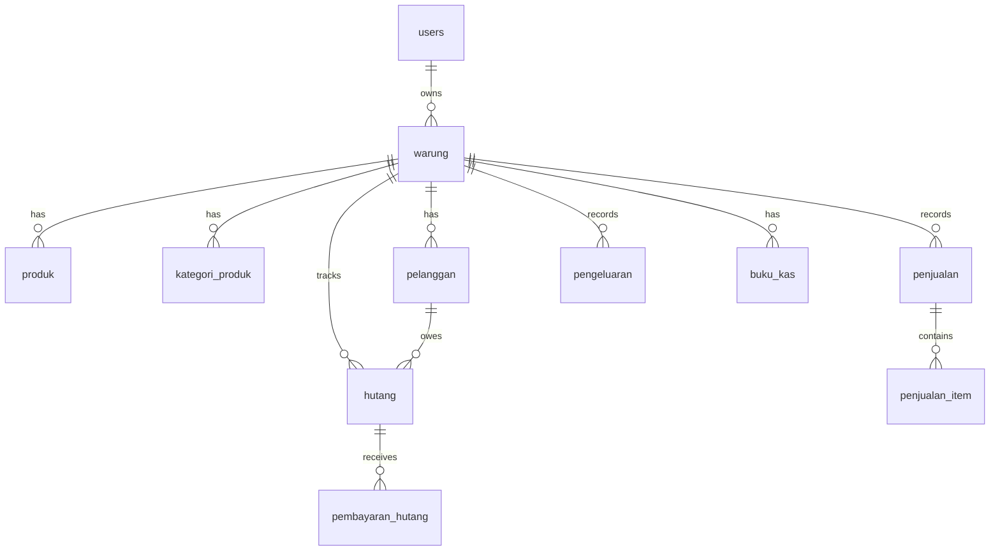

# CatatCuan - Design Blueprint

**Version:** 1.0 | **Generated:** 2026-01-29 | **Status:** ✅ Ready for Development

---

## Quick Summary

| Aspect | Value |
|--------|-------|
| **Project** | CatatCuan - Asisten Keuangan Digital Toko Kelontong |
| **Type** | Finance App (UMKM Cash Flow) |
| **Total ADRs** | 1 |
| **Total Tables** | 17 |
| **Total API Endpoints** | 45+ (Supabase + Admin) |
| **Total Screens** | 42 (35 Mobile + 7 Admin) |
| **Timeline** | 8 minggu (MVP) |
| **Budget** | Rp 800.000 |

---

## Visual Diagrams (Figma)

### Use Case Diagram


### ERD (Entity Relationship Diagram)


### Activity Diagram


### Application Flowchart


---

## 1. Project Overview

### Problem Statement

> **Pemilik Toko Kelontong Tradisional** kesulitan **mengelola arus kas** karena **catatan manual berantakan dan "bocor alus"** yang menyebabkan **modal tidak berkembang dan profit tidak jelas**.

### Top Pain Points

| # | Pain Point | Score |
|---|------------|-------|
| 1 | **Bocor Alus** — Modal tergerus tanpa tercatat | 🔴 8/10 |
| 2 | **Stok Gaib** — Barang habis baru tahu saat ditanya | 🟡 7/10 |
| 3 | **Pusing Hitung Laba** — Tidak tahu untung bersih | 🟡 7/10 |

### Scope

#### ✅ In Scope (MVP)

| # | Feature | Platform |
|---|---------|----------|
| 1 | 🛒 Transaksi Penjualan (POS) | Mobile |
| 2 | 📦 Manajemen Produk & Stok | Mobile |
| 3 | 💸 Pencatatan Pengeluaran | Mobile |
| 4 | 📖 Buku Kas (Digital Ledger) | Mobile |
| 5 | 🤝 Manajemen Hutang | Mobile |
| 6 | 👥 Database Pelanggan | Mobile |
| 7 | 📊 Laporan Keuangan | Mobile |
| 8 | ⚡ Offline Mode + Auto Sync | Mobile |
| 9 | 📈 Admin: Dashboard Statistik | Web |
| 10 | 👤 Admin: Manajemen User | Web |
| 11 | 🔧 Admin: Maintenance System | Web |
| 12 | 📋 Admin: Master Data | Web |

#### ❌ Out of Scope

- Phase 1.5: Backup Manual, Admin Analytics, Broadcast
- Phase 2: Reminder, Multi-language, iOS, Payment Gateway, Full Inventory, Multi-Store

### Success Metrics

| Metric | Target | Deadline |
|--------|--------|----------|
| Play Store Launch | 1 app published | 15 Mar 2026 |
| Downloads | 50 | 31 Mar 2026 |
| User Retention | 30% DAU/MAU | 30 Apr 2026 |

---

## 2. Tech Stack

| Category | Technology | Version | Rationale |
|----------|------------|---------|-----------|
| **Mobile** | Flutter | 3.24+ | Cross-platform, offline-first, user preference |
| **Mobile DB** | Drift (SQLite) | 2.x | Type-safe, reactive, best for offline |
| **Sync Layer** | PowerSync | Latest | Automatic two-way sync with Supabase |
| **Backend** | Supabase | - | PostgreSQL + Auth + Storage + Realtime |
| **Admin Dashboard** | Next.js | 14.x | Full-stack React, SSR, API routes |
| **UI (Admin)** | Tailwind + shadcn/ui | 3.4+ | Fast development, professional look |
| **Hosting** | Vercel | - | Free tier, Next.js integrated |
| **Auth** | Supabase Auth | - | Built-in, email/phone |

---

## 3. Architecture

### Pattern: Layered Architecture + Feature-First Organization

```
┌─────────────────────────────────────────┐
│         PRESENTATION LAYER              │
│   (UI, Widgets, Pages, State Mgmt)      │
├─────────────────────────────────────────┤
│         APPLICATION/SERVICE LAYER       │
│   (Use Cases, Business Logic)           │
├─────────────────────────────────────────┤
│         DATA LAYER                      │
│   (Repositories, Data Sources, Models)  │
└─────────────────────────────────────────┘
```

### ADR Summary

| ID | Title | Status | Decision |
|----|-------|--------|----------|
| [ADR-001](file:///d:/Fachri/WORKSPACES/CatatCuan/AI-Agent/Output/Design/CatatCuan/ADR-001_architecture.md) | Layered Architecture | ✅ Accepted | Use Layered Architecture with Feature-First organization for Flutter & Next.js |

### Folder Structure

#### Flutter Mobile

```
lib/
├── main.dart
├── app/                         # App configuration
├── core/                        # Shared core utilities
│   ├── constants/
│   ├── theme/
│   ├── utils/
│   └── widgets/
├── features/                    # Feature-first organization
│   ├── auth/
│   ├── onboarding/
│   ├── penjualan/
│   ├── produk/
│   ├── pengeluaran/
│   ├── buku_kas/
│   ├── hutang/
│   ├── pelanggan/
│   └── laporan/
├── data/                        # Shared data layer
│   ├── local/ (Drift)
│   ├── remote/ (Supabase)
│   └── sync/ (PowerSync)
└── services/
```

#### Next.js Admin

```
src/
├── app/
│   ├── (auth)/
│   ├── (dashboard)/
│   │   ├── users/
│   │   ├── maintenance/
│   │   └── master-data/
│   └── api/
├── components/
│   ├── ui/ (shadcn/ui)
│   ├── dashboard/
│   └── shared/
├── lib/
│   ├── supabase/
│   └── utils/
├── types/
└── hooks/
```

---

## 4. Database

### ERD Overview



### Tables Summary (17 Tables)

| # | Table | Type | Purpose |
|---|-------|------|---------|
| 1 | `users` | Core | Akun pengguna |
| 2 | `warung` | Core | Profil toko/warung |
| 3 | `kategori_produk` | Master | Kategori produk |
| 4 | `produk` | Master | Data produk + stok |
| 5 | `pelanggan` | Master | Database pelanggan |
| 6 | `penjualan` | Transaction | Header transaksi POS |
| 7 | `penjualan_item` | Transaction | Detail item penjualan |
| 8 | `kategori_pengeluaran` | Master | Kategori expense |
| 9 | `pengeluaran` | Transaction | Pencatatan expense |
| 10 | `buku_kas` | Ledger | Jurnal kas masuk/keluar |
| 11 | `hutang` | Transaction | Piutang pelanggan |
| 12 | `pembayaran_hutang` | Transaction | Cicilan pembayaran |
| 13 | `laporan_harian` | Cache | Agregasi harian |
| 14 | `admin_users` | Admin | Admin dashboard users |
| 15 | `app_config` | Admin | Konfigurasi sistem |
| 16 | `master_kategori_produk` | Admin | Template kategori |
| 17 | `system_logs` | Admin | Audit log |

### Index Strategy

| Table | Column(s) | Purpose |
|-------|-----------|---------|
| `produk` | `warung_id, barcode` | Barcode scan |
| `produk` | `warung_id, is_active` | Active filter |
| `penjualan` | `warung_id, tanggal` | Date range queries |
| `hutang` | `warung_id, status` | Status filter |
| `buku_kas` | `warung_id, tanggal` | Date range queries |

### Row Level Security (RLS)

All user-facing tables have RLS enabled. Users can only access data from their own `warung`.

📄 **Full Schema:** [04_database_design.md](file:///d:/Fachri/WORKSPACES/CatatCuan/AI-Agent/Output/Design/CatatCuan/04_database_design.md)

---

## 5. API Design

### Architecture

```
┌──────────────┐     ┌──────────────┐
│ FLUTTER APP  │     │ NEXT.JS ADMIN│
└──────┬───────┘     └──────┬───────┘
       └──────────┬─────────┘
                  ▼
       ┌─────────────────────┐
       │   SUPABASE GATEWAY  │
       │  PostgREST + RPC    │
       └─────────────────────┘
```

### Authentication

- **Provider:** Supabase Auth (JWT)
- **Methods:** Phone + Password, Email + Password
- **Token:** Bearer JWT in Authorization header

### Endpoints Summary

#### Supabase REST API

| Resource | CRUD Operations |
|----------|-----------------|
| `/rest/v1/warung` | GET, POST, PATCH |
| `/rest/v1/produk` | GET, POST, PATCH, DELETE |
| `/rest/v1/pelanggan` | GET, POST, PATCH, DELETE |
| `/rest/v1/penjualan` | GET, POST, PATCH |
| `/rest/v1/pengeluaran` | GET, POST, PATCH, DELETE |
| `/rest/v1/buku_kas` | GET |
| `/rest/v1/hutang` | GET |

#### RPC Functions (Custom Logic)

| Function | Purpose |
|----------|---------|
| `create_penjualan` | Create sale + items + update stock + buku kas |
| `bayar_hutang` | Pay debt + update saldo |
| `get_saldo_kas` | Get current cash balance |

#### Admin API (Next.js)

| Endpoint | Purpose |
|----------|---------|
| `/api/v1/stats/*` | Dashboard statistics |
| `/api/v1/users/*` | User management |
| `/api/v1/config/*` | System configuration |
| `/api/v1/master/*` | Master data CRUD |

### Response Envelope

```json
{
  "data": { ... },
  "meta": { "total": 100, "page": 1 },
  "error": null
}
```

### Rate Limiting

| Client | Limit |
|--------|-------|
| Public | 60/min |
| Authenticated | 200/min |
| Admin | 500/min |

📄 **Full API Spec:** [05_api_design.md](file:///d:/Fachri/WORKSPACES/CatatCuan/AI-Agent/Output/Design/CatatCuan/05_api_design.md) | [openapi.yaml](file:///d:/Fachri/WORKSPACES/CatatCuan/AI-Agent/Output/Design/CatatCuan/openapi.yaml)

---

## 6. UI/UX

### Design Style

**Flat Design + Big Touch Targets**

- Solid colors (no gradients)
- Clear borders & shadows for depth
- Large touch targets (min 48dp, recommended 64dp)
- High contrast text (4.5:1 minimum)

### Design Tokens

#### Colors

| Token | Value | Usage |
|-------|-------|-------|
| Primary | `#13B158` | Main actions, headers |
| Primary Dark | `#0E8A44` | Pressed state |
| Secondary | `#EAA220` | CTA buttons, warnings |
| Success | `#13B158` | Uang Masuk |
| Error | `#DC2626` | Uang Keluar |
| Border | `#D1EDD8` | Card outlines |
| Text Primary | `#111827` | Main text |
| Text Secondary | `#6B7280` | Captions |

#### Typography

| Level | Size | Weight |
|-------|------|--------|
| H1 | 32px | Bold |
| H2 | 24px | SemiBold |
| Body Large | 18px | Regular |
| Body | 16px | Regular |
| Caption | 14px | Regular |
| Button | 18px | SemiBold |

**Font:** Inter (Google Fonts)

### Screen Inventory (42 Screens)

| Category | Count | Screens |
|----------|-------|---------|
| **Onboarding** | 8 | Splash, Slides (3), Register, Login, Setup Warung, Setup Saldo |
| **Dashboard** | 1 | Home with stats, quick actions, recent transactions |
| **POS/Penjualan** | 6 | Product Search, Cart, Checkout, Receipt, History, Detail |
| **Produk** | 4 | List, Detail, Add/Edit, Low Stock Alert |
| **Pengeluaran** | 3 | List, Add, Categories |
| **Buku Kas** | 2 | Cash Book, Transaction Detail |
| **Hutang** | 4 | List, Detail, Pay, History |
| **Pelanggan** | 3 | List, Detail, Add/Edit |
| **Laporan** | 3 | Dashboard, Daily, Export |
| **Settings** | 3 | Menu, Profile, Sync Status |
| **Admin (Web)** | 7 | Login, Dashboard, Users, User Detail, Config, Categories, Logs |

### Component States

| State | Visual |
|-------|--------|
| Empty | Illustration + "Belum ada data" + CTA |
| Loading | Skeleton/Shimmer |
| Ideal | Full data display |
| Error | Error icon + Message + Retry |
| Offline | Offline banner + Local data |

### Accessibility (WCAG 2.1 AA) ✅

- [x] Color contrast ≥ 4.5:1
- [x] Touch targets ≥ 48dp
- [x] All images have alt text
- [x] Form inputs have labels
- [x] Semantic headings

📄 **Full UI/UX Spec:** [06_ui_ux_design.md](file:///d:/Fachri/WORKSPACES/CatatCuan/AI-Agent/Output/Design/CatatCuan/06_ui_ux_design.md)  
📄 **Wireframes:** [wireframe.md](file:///d:/Fachri/WORKSPACES/CatatCuan/AI-Agent/Output/Design/CatatCuan/wireframes/wireframe.md)  
📄 **Design Tokens:** [design-tokens.json](file:///d:/Fachri/WORKSPACES/CatatCuan/AI-Agent/Output/Design/CatatCuan/design-tokens.json)

---

## 7. Security

### Authentication

| Aspect | Implementation |
|--------|----------------|
| Provider | Supabase Auth (GoTrue) |
| Methods | Phone + Password |
| Token | JWT (short-lived) + Refresh |
| Admin | Separate email-based login |

### Authorization

| Mechanism | Description |
|-----------|-------------|
| Row Level Security | Users can only access their own warung data |
| Admin Role | Separate `admin_users` table with role enum |

### Data Protection

| Aspect | Implementation |
|--------|----------------|
| Encryption in Transit | HTTPS (TLS 1.3) |
| Encryption at Rest | Supabase managed |
| Password Storage | bcrypt (via Supabase Auth) |

### Security Headers

```
X-Content-Type-Options: nosniff
X-Frame-Options: DENY
Strict-Transport-Security: max-age=31536000
Content-Security-Policy: default-src 'self'
```

---

## 8. Development Handoff

### Quick Start

#### 1. Clone & Setup Flutter

```bash
# Clone repo
git clone <repo-url>
cd catatcuan-mobile

# Install dependencies
flutter pub get

# Run app
flutter run
```

#### 2. Setup Supabase

```bash
# Create Supabase project at supabase.com
# Run migrations in order: M001 → M009
# Enable RLS on all tables
# Copy API keys
```

#### 3. Setup Admin Dashboard

```bash
cd catatcuan-admin
npm install
npm run dev
```

### Environment Variables

#### Flutter (.env)

```env
SUPABASE_URL=https://xxx.supabase.co
SUPABASE_ANON_KEY=eyJ...
POWERSYNC_URL=https://xxx.powersync.co
```

#### Next.js (.env.local)

```env
NEXT_PUBLIC_SUPABASE_URL=https://xxx.supabase.co
NEXT_PUBLIC_SUPABASE_ANON_KEY=eyJ...
SUPABASE_SERVICE_ROLE_KEY=eyJ...
```

### Sprint 1 Tasks (Week 1-2)

| # | Task | Priority |
|---|------|----------|
| 1 | Setup Flutter project with Drift + PowerSync | 🔴 High |
| 2 | Setup Supabase project + Run migrations | 🔴 High |
| 3 | Implement Auth (Login/Register) | 🔴 High |
| 4 | Create Dashboard screen | 🔴 High |
| 5 | Implement Product CRUD | 🔴 High |
| 6 | Setup Next.js admin skeleton | 🟡 Medium |

---

## Appendix

### File References

| Document | Path |
|----------|------|
| Planning Blueprint | [10_planning_blueprint.md](file:///d:/Fachri/WORKSPACES/CatatCuan/AI-Agent/Output/Planning/CatatCuan/10_planning_blueprint.md) |
| Tech Decision | [06_tech_decision.md](file:///d:/Fachri/WORKSPACES/CatatCuan/AI-Agent/Output/Planning/CatatCuan/06_tech_decision.md) |
| Use Case Diagram | [01_use_case_diagram.md](file:///d:/Fachri/WORKSPACES/CatatCuan/AI-Agent/Output/Design/CatatCuan/01_use_case_diagram.md) |
| ERD Diagram | [02_erd_diagram.md](file:///d:/Fachri/WORKSPACES/CatatCuan/AI-Agent/Output/Design/CatatCuan/02_erd_diagram.md) |
| Activity Diagram | [03_activity_diagram.md](file:///d:/Fachri/WORKSPACES/CatatCuan/AI-Agent/Output/Design/CatatCuan/03_activity_diagram.md) |
| ADR-001 | [ADR-001_architecture.md](file:///d:/Fachri/WORKSPACES/CatatCuan/AI-Agent/Output/Design/CatatCuan/ADR-001_architecture.md) |
| Database Design | [04_database_design.md](file:///d:/Fachri/WORKSPACES/CatatCuan/AI-Agent/Output/Design/CatatCuan/04_database_design.md) |
| API Design | [05_api_design.md](file:///d:/Fachri/WORKSPACES/CatatCuan/AI-Agent/Output/Design/CatatCuan/05_api_design.md) |
| OpenAPI Spec | [openapi.yaml](file:///d:/Fachri/WORKSPACES/CatatCuan/AI-Agent/Output/Design/CatatCuan/openapi.yaml) |
| UI/UX Design | [06_ui_ux_design.md](file:///d:/Fachri/WORKSPACES/CatatCuan/AI-Agent/Output/Design/CatatCuan/06_ui_ux_design.md) |
| Design Tokens | [design-tokens.json](file:///d:/Fachri/WORKSPACES/CatatCuan/AI-Agent/Output/Design/CatatCuan/design-tokens.json) |
| Wireframes | [wireframe.md](file:///d:/Fachri/WORKSPACES/CatatCuan/AI-Agent/Output/Design/CatatCuan/wireframes/wireframe.md) |

### Visual Diagram Files

| Diagram | Path |
|---------|------|
| Use Case Diagram | [use_case_diagram.png](file:///d:/Fachri/WORKSPACES/CatatCuan/AI-Agent/Output/Design/CatatCuan/diagrams/use_case_diagram.png) |
| ERD Diagram | [erd_diagram.png](file:///d:/Fachri/WORKSPACES/CatatCuan/AI-Agent/Output/Design/CatatCuan/diagrams/erd_diagram.png) |
| Activity Diagram | [activity_diagram.png](file:///d:/Fachri/WORKSPACES/CatatCuan/AI-Agent/Output/Design/CatatCuan/diagrams/activity_diagram.png) |
| Flowchart | [flowchart.png](file:///d:/Fachri/WORKSPACES/CatatCuan/AI-Agent/Output/Design/CatatCuan/diagrams/flowchart.png) |

### Design Files Status

| File | Status |
|------|--------|
| Planning Blueprint | ✅ Complete |
| Tech Decision | ✅ Complete |
| Use Case Diagram | ✅ Complete (with Figma visual) |
| ERD Diagram | ✅ Complete (with Figma visual) |
| Activity Diagram | ✅ Complete (with Figma visual) |
| Flowchart | ✅ Complete (Figma visual) |
| ADR-001 Architecture | ✅ Complete |
| Database Design | ✅ Complete |
| API Design | ✅ Complete |
| OpenAPI Spec | ✅ Complete |
| UI/UX Design | ✅ Complete |
| Design Tokens | ✅ Complete |
| Wireframes | ✅ Complete |
| Accessibility Audit | ⚠️ Not created (inline in UI/UX) |
| Threat Model | ⚠️ Not created |
| Security Checklist | ⚠️ Not created |

---

**🎉 DESIGN PHASE COMPLETE!**

**Ready for Development Phase ✅**

---

*Generated by /compile-design-blueprint workflow (WF-SPEC07)*  
*Date: 2026-01-29*
